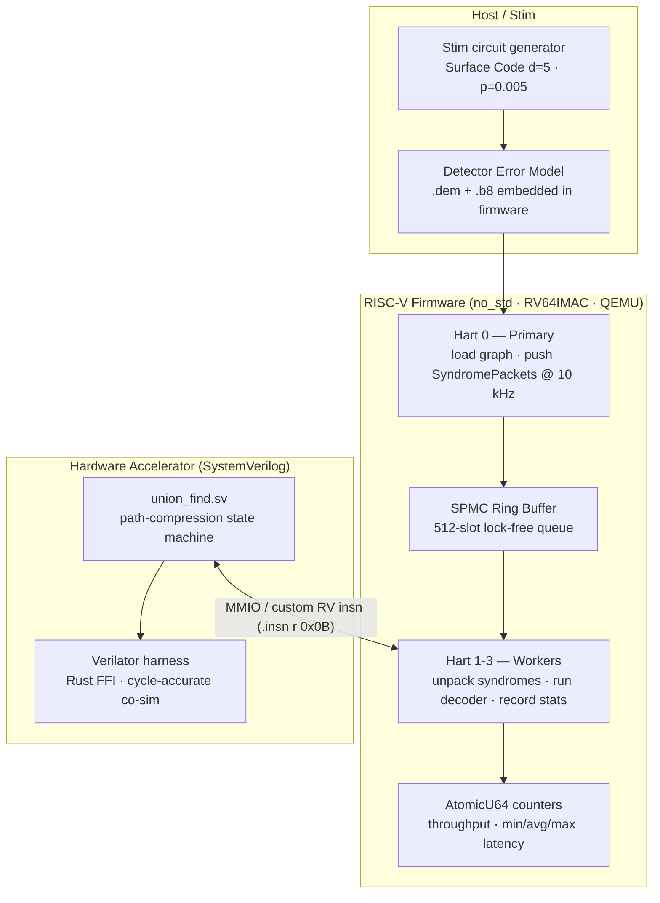
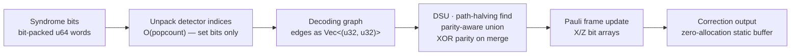
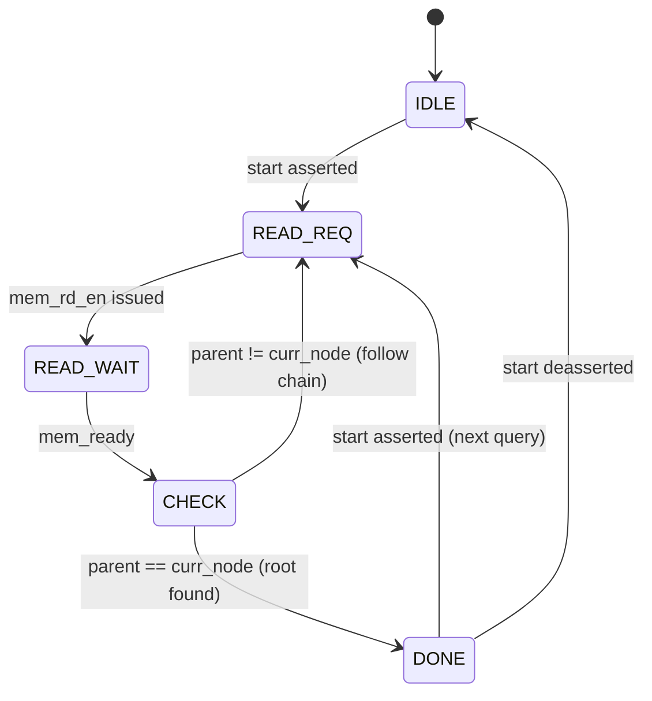

# RISC-V Quantum Control Unit

A bare-metal firmware stack and hardware architecture for real-time Quantum Error Correction (QEC). Targets RISC-V soft-cores with a focus on deterministic execution, low-latency decoding, and hardware-software co-design.

Decodes Surface Code errors using a zero-allocation Union-Find decoder, a custom ISA, and a SystemVerilog hardware accelerator verified via Verilator co-simulation.

## System Architecture



The architecture is divided into three layers:

### Core Logic (`qcu_core`)
Implements the Union-Find decoder with path compression and parity tracking, the decoding graph, Pauli frame, and a custom bump allocator backed by static memory. All hot-path allocations are zero-cost at decode time.

### Firmware (`qcu_firmware`)
A `no_std` kernel for RV64IMAC. Hart 0 loads the decoding graph from an embedded DEM file and pushes syndrome packets into a lock-free SPMC ring buffer at ~10 kHz. Worker harts pop packets, unpack syndrome bits, and run the decoder in parallel. Latency statistics are tracked with atomics and printed every 10M cycles.

### Hardware Acceleration (`qcu_hw`)
The `Find` operation is partially offloaded to `union_find.sv` via a custom RISC-V instruction. A Verilator-based co-simulation harness wraps the generated C++ model via Rust FFI for cycle-accurate verification against the software reference.

## Decoder Pipeline



Each DSU cluster carries a parity bit (XOR of edge parities along the path to root). A cluster with odd parity has an uncorrected error — the correction set is built from all odd-parity cluster roots.

## Hardware State Machine



`union_find.sv` walks the parent array through a memory interface, returning the root node in hardware. The state machine exits when it finds a self-referential parent (the root), implementing path traversal in O(depth) clock cycles.

## Technical Implementation

- **Zero-allocation decode loop:** All graph nodes, scratch buffers, and DSU state are pre-allocated at boot via a bump allocator (`0x8400_0000`, 4 MB). The hot path never calls `malloc`.
- **Bit-packed syndrome data:** Syndrome bits are packed into `u64` words; the decoder unpacks only set bits (`O(popcount)`), minimising work on sparse error patterns.
- **Lock-free concurrency:** The SPMC queue uses atomic head/tail pointers — no mutexes on any critical path.
- **Verilator co-sim:** `build.rs` compiles `union_find.sv` via Verilator into a C++ model linked via FFI for cycle-accurate hardware verification.

## Performance

| Environment | Metric | Value |
|---|---|---|
| RISC-V QEMU (4 harts) | Peak throughput | ~55,000 shots/s |
| RISC-V QEMU | Zero-load latency | ~580 cycles |
| @ 100 MHz FPGA | Latency | ~5.8 µs |
| @ 1 GHz ASIC | Latency | ~0.58 µs |
| RISC-V QEMU | Jitter | < 50 cycles |
| x86_64 host | Single-thread throughput | ~40,000 shots/s |

Quantum error correction must complete within the qubit coherence time (~1–100 µs for superconducting qubits). The 0.58 µs ASIC target sits well within this window.

## Usage

A Python workflow script manages data generation, compilation, and simulation.

**Generate syndrome data**
```bash
./scripts/run.py gen --size 5 --shots 10000
```

**Host decoder benchmark**
```bash
./scripts/run.py stream --freq 100000
```

**Boot firmware on RISC-V QEMU (4-core SMP)**
```bash
./scripts/run.py kernel
```

**Build hardware co-simulation model** (requires Verilator)
```bash
cargo build -p qcu_hw
```

Firmware prints throughput and latency statistics every 10M cycles:
```
T=  1s | Rate:  55213/s | Lat:  561/ 583/ 614 | Q:    3
```

## Dependencies

| Tool | Purpose |
|---|---|
| Rust nightly | `allocator_api`, `generic_const_exprs` |
| `qemu-system-riscv64` | Firmware simulation |
| Verilator | SystemVerilog co-simulation |
| Python 3 + `stim` | Surface Code circuit generation |
| RISC-V GCC | Firmware cross-compilation |
